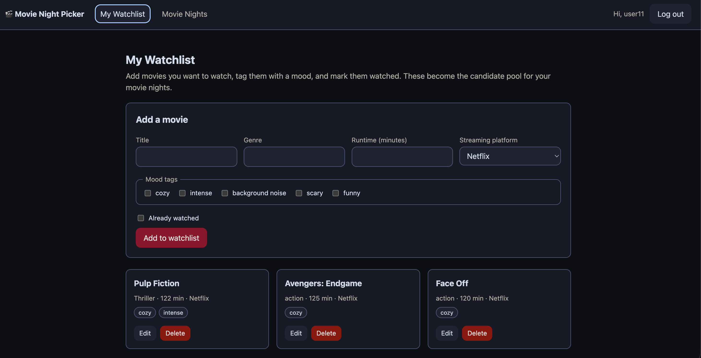
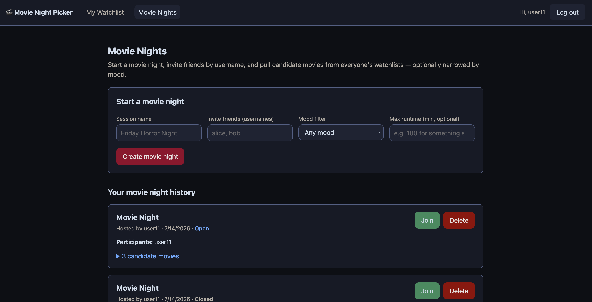
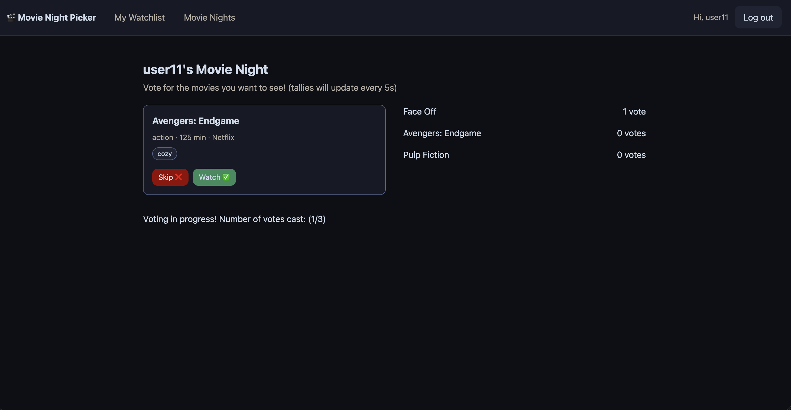
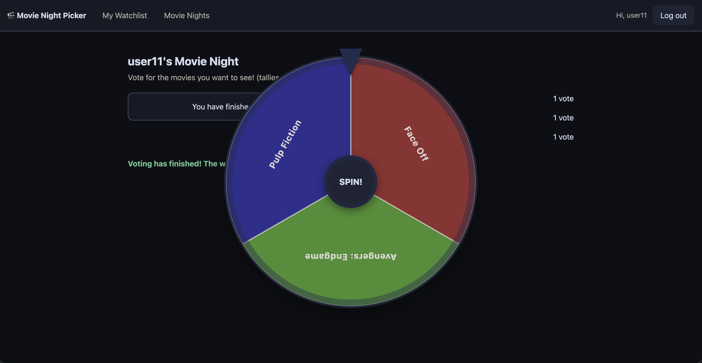

# 🎬 Movie Night Picker

A full-stack web app that solves the "what should we watch tonight?" problem.
Users build a personal movie watchlist tagged with mood, genre, and streaming
platform, then start a **Movie Night Session** and invite friends to vote on
candidate movies pulled from everyone's lists. If the group can't agree, a
weighted random-spin picker breaks the tie.

## Authors

- **Sumer Shinde** — US-01 (Profile & Watchlist CRUD) and US-02 (Create Movie
  Night Session), plus authentication and app scaffold.
- **Catherine Han** — US-03 (Swipe & Vote on candidates) and US-04 (Random
  picker wheel tiebreaker).

## Class Link

CS5610 Web Development — Northeastern University
(https://johnguerra.co/classes/webDevelopment_summer_2025/)

## Project Objective

Give a group of friends a fast, fair, and fun way to agree on a movie to watch,
combining a personal watchlist tracker with a group decision-making session and
a weighted random tiebreaker.

## Screenshot

Here are the screenshots of all four user stories.<br />
<br />
<br />
<br />
<br />

## Tech Stack

- **Frontend:** React 18 (hooks) + React Router, built with Vite. Data requests
  use the native **Fetch API**.
- **Backend:** Node.js + Express.
- **Database:** MongoDB via the official **native driver** (no Mongoose).
- **Auth:** Passport (local strategy) with `express-session`.

No prohibited libraries are used (no axios, no Mongoose, no CORS).

## Data Model (3 collections)

- **users** — account info (username, display name, hashed password).
- **movies** — personal watchlist entries (title, genre, mood tags, runtime,
  platform, watched flag). Owned by a user.
- **sessions** — a movie night (host, participants, candidate movies, votes,
  winning pick).

Full CRUD is implemented on **movies** and on **sessions**.

## Requirements

- Node.js 18+
- A MongoDB database (a free [MongoDB Atlas](https://www.mongodb.com/atlas)
  cluster works well)

## Build & Run Instructions

### 1. Clone and configure environment variables

```bash
git clone <your-repo-url>
cd Movie-Night-Picker
cp .env.example backend/.env
```

Edit `backend/.env` and fill in:

- `MONGO_URI` — your MongoDB connection string
- `DB_NAME` — e.g. `movie_night`
- `SESSION_SECRET` — any long random string

### 2. Install dependencies

```bash
cd backend && npm install
cd ../frontend && npm install
```

### 3. Seed the database (1,200+ synthetic records)

```bash
cd backend
npm run seed
```

This creates 20 demo users and 1,200 movies. You can log in with:

- **username:** `demo`
- **password:** `password`

### 4. Run in development (two terminals)

```bash
# Terminal 1 — backend API on http://localhost:4000
cd backend && npm run dev

# Terminal 2 — React dev server on http://localhost:5173
cd frontend && npm run dev
```

Open http://localhost:5173. The Vite dev server proxies `/api` to the backend,
so everything stays same-origin.

### 5. Run in production mode locally

```bash
cd frontend && npm run build   # outputs frontend/dist
cd ../backend && npm start     # serves API + the built frontend on :4000
```

Then open http://localhost:4000.

## How to Use the App

1. **Sign up** or log in with the demo account.
2. **My Watchlist** — add movies with a genre, runtime, streaming platform, and
   mood tags. Edit, mark watched, or delete any entry (full CRUD).
3. **Movie Nights** — start a session, invite friends by username, and pick a
   mood filter (e.g. "scary") or a max runtime. The app automatically gathers
   matching unwatched movies from everyone's watchlists as candidates.
4. Your past sessions are listed as a movie night history log.
5. (US-03 / US-04) Participants vote on candidates and spin the weighted picker
   to break ties.

## Linting & Formatting

```bash
# Backend
cd backend && npm run lint && npm run format

# Frontend
cd frontend && npm run lint && npm run format
```

## Deployment

See [DEPLOY.md](DEPLOY.md) for step-by-step Render deployment instructions.

## License

[MIT](LICENSE)
